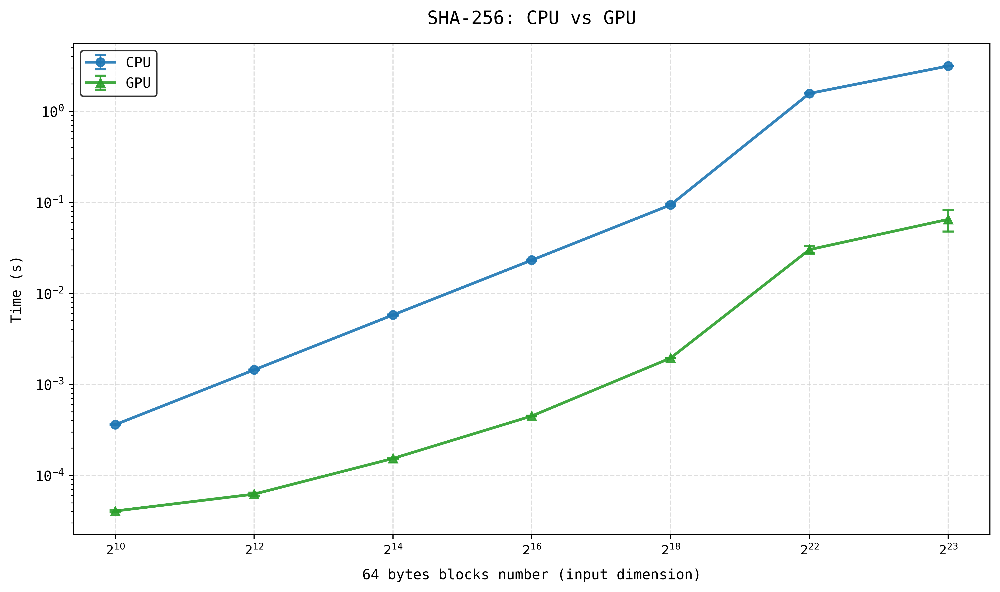
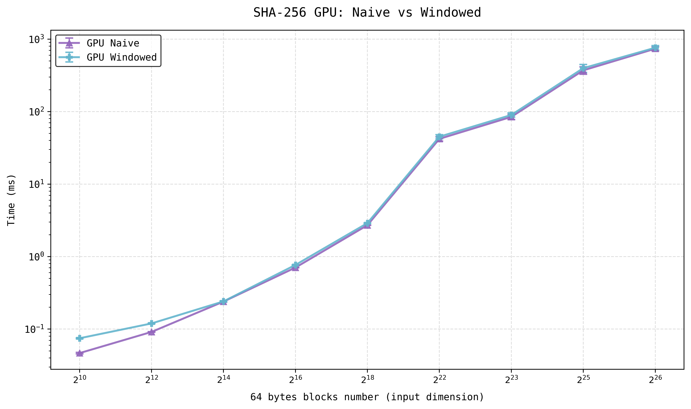
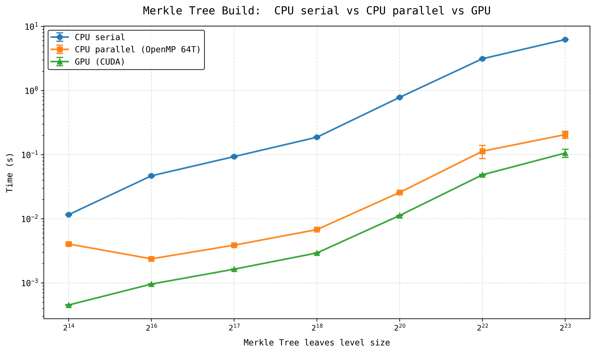
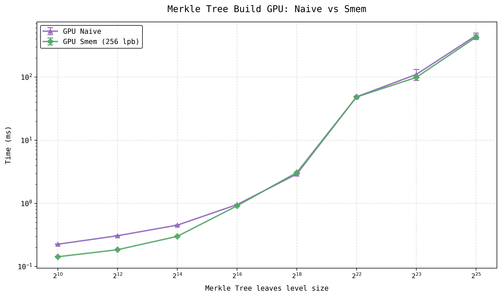
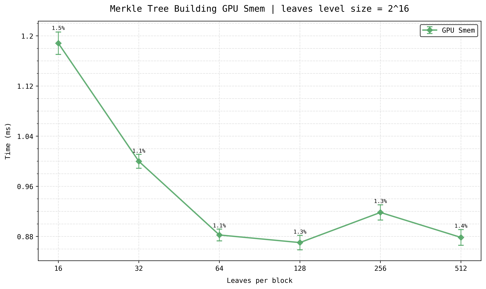
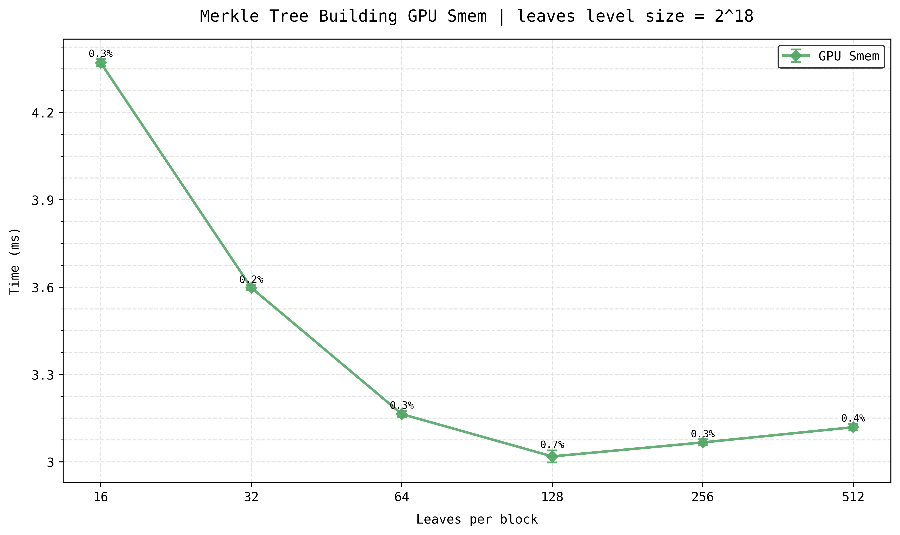
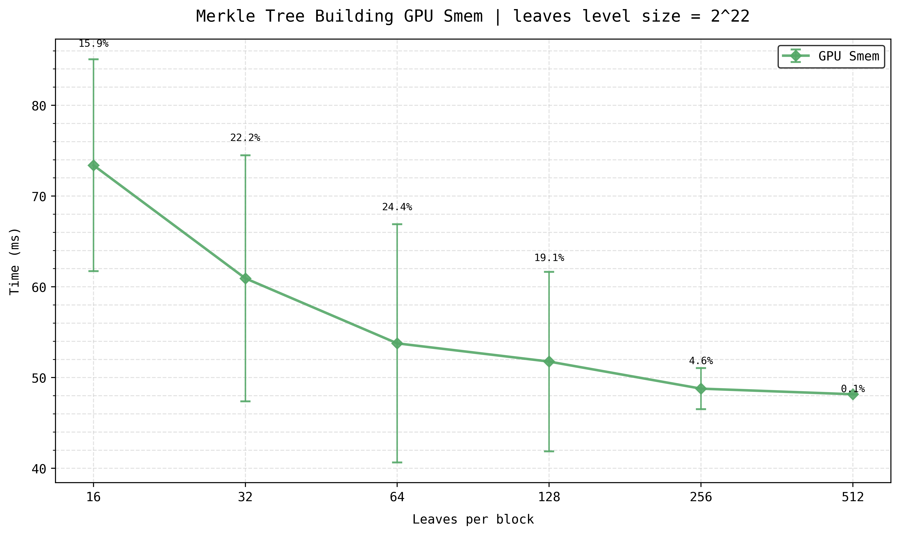
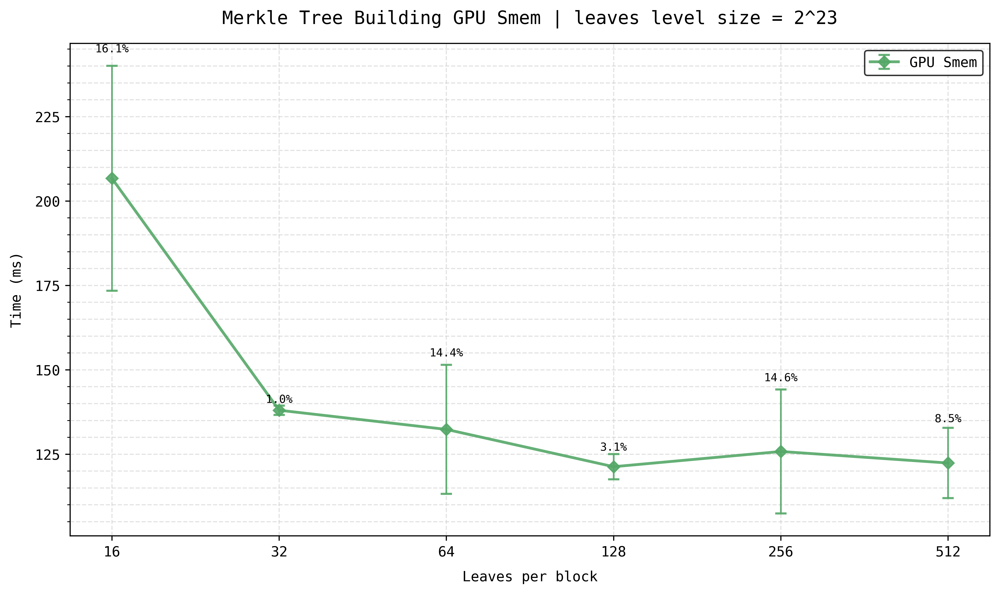
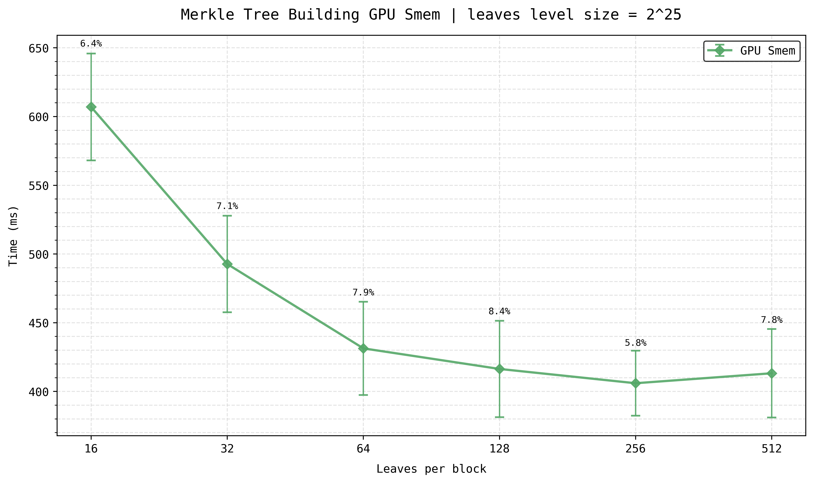
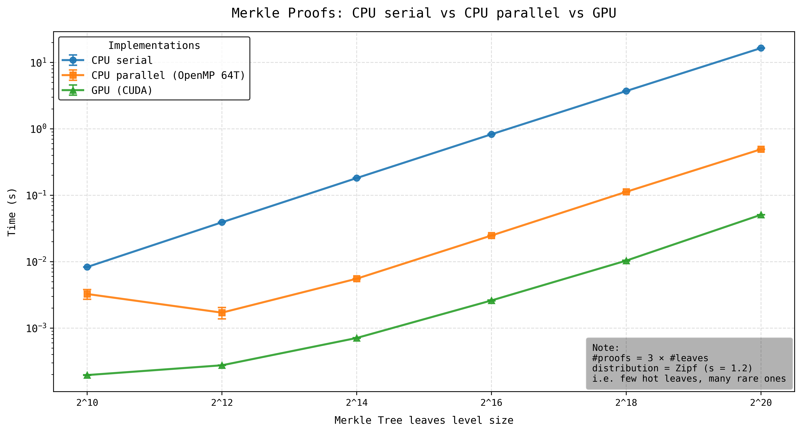

# CUDA Merkle Tree

High-performance implementation of a Merkle Tree on GPU using CUDA.

This project explores how to leverage GPU parallelism to efficiently compute Merkle trees, commonly used in cryptography, blockchains, and data integrity systems. The implementation is supported by performance benchmarks, whose results are presented below.

## Highlights

- CUDA implementation of Merkle Tree construction and proof verification.
- Up to **~1 order of magnitude reduction** in execution time (tree construction) vs serial CPU baseline, and strong improvements over parallel CPU implementations.
- Up to **~2 orders of magnitude reduction** in execution time (proof verification) vs serial CPU baseline, with consistent gains over parallel CPU implementations.
- **Shared-memory optimized** kernel.
- OpenMP CPU baseline.
- **Profiling with NVIDIA Nsight Compute**.
- Analysis of occupancy, cache utilization, register pressure and warp stalls.

## Repository Structure

- `benchmarks/`: this directory contains the source code for performance evaluation and benchmarking.
- `data/`: this directory contains the source code to generate both the data blocks (64 byte) used to build the leaves level of the merkle tree and the merkle proof.
- `merkle/`: this directory contains the source code both for the merkle tree building and for the merkle proof verification.
- `sha256/`: this directory contains both the CPU implementation and the GPU implementation of sha256 hash function (FIPS 180-4 compliant). 
- `tests/`: contains all tests used to validate the correctness of the proposed solution.

## SHA256: Standard vs Windowed Implementation

This project includes two variants of the SHA-256:

- Standard implementation: uses a full 64-word message schedule (`W[64]`)
- Windowed implementation: uses a rolling buffer of only 16 words.

In SHA-256, each word `W[i]` depends only on: `W[i-2]`, `W[i-7]`, `W[i-15]`, `W[i-16]`. This means that storing all 64 words is not strictly necessary. The windowed approach exploits this by keeping only the last 16 values. 

This design reduces the per-thread memory footprint. Since each GPU thread independently performs the hashing operation, it must maintain its own message schedule; shrinking it from 64 to 16 words significantly lowers register pressure and local memory usage.

The impact of this optimization is evaluated through the benchmarks reported below.

## Merkle Tree

In this repository, Merkle trees are represented as array-based heaps, with the root at the first position and the leaves at the end of the array. This approach avoids pointer-based structures and enables contiguous memory access, which is crucial for GPU performance.

On the GPU side, two different merkle tree building implementations are provided:
- **Naive implementation**: a kernel computes a single level of the Merkle tree at a time, starting from the lowest level. The kernel is launched repeatedly, once per tree level, until the root is reached.
- **SMEM-optimized implementation**: that builds multiple levels of the tree within a single launch. Each block is responsible for constructing a subtree stored in shared memory (SMEM), which is then written back to global memory (GMEM) once completed. The size of the subtree can be configured using the `leaves_per_block` parameter, and it is the same for all blocks.

The choice between the SHA-256 implementations used in Merkle tree construction is controlled via a compile-time macro `SHA256_WINDOWED` defined in `merkle/utils.h`. While this approach is not ideal from a software design perspective, it was deliberately chosen to simplify experimentation and focus on performance analysis.

## Merkle Proof

The repository includes a mechanism (`data/`) to generate batches of Merkle proof requests starting from a fixed set of input data blocks (64 bytes) previously used to construct the leaves level of the Merkle tree.

Merkle proof batches are generated using different sampling strategies over the leaf space.

- **Uniform coverage**: each leaf is guaranteed to appear at least once in the batch.
- **Zipf (skewed)**: selection follows a power-law distribution, controlled by an exponent, producing realistic workloads with a small number of frequently accessed leaves.

These modes allow benchmarking under both balanced and realistic access patterns.

On the GPU-side Merkle Proof verification is performed in parallel, each thread independently validates a single proof. For each request, the process starts from a leaf hash and iteratively recomputes parent hashes using the authentication path. At each level, the computed hash is compared against the corresponding node stored in the Merkle tree. If all intermediate hashes match and the final reconstructed root equals the stored root, the proof is considered valid; otherwise, it is rejected.

### Design Choice

In this project, Merkle proofs are adapted from their classical form used in trustless systems, where each proof is self-contained and does not assume access to the full Merkle tree.

Traditionally, a Merkle proof includes the leaf (or its hash), sibling hashes along the path to the root, directional flags, and the Merkle root, allowing independent verification.

In this implementation, the single entire Merkle tree is kept in GPU memory to enable high-throughput batch verification. As a result, proofs are simplified and act as references to leaf nodes, while all necessary sibling data is directly accessed from the in-memory tree.

## Compilation

- `make test`: builds the test executables.
- `make bench`: builds the benchmark executables.

After compilation, the corresponding binaries can be run manually.

# Benchmarks

All benchmarks were executed on a dual-socket server equipped with:

- **CPU:** 2 × Intel Xeon E5-2650 v3 @ 2.30 GHz
- **Physical Cores:** 20
- **Hardware Threads:** 40
- **L3 Cache:** 50 MB
- **Architecture:** x86_64
- **GPU:** NVIDIA Ampere 30
- **CUDA Toolkit:** 12.x
- **Operating System:** Linux

## Benchmark Methodology

All benchmark results reported in this repository were obtained using randomly generated input datasets. For each benchmark configuration, a new set of input blocks was generated and subsequently reused across both CPU and GPU implementations to ensure a fair and reproducible comparison.

Execution times were measured in nanoseconds. Each benchmark configuration was executed 20 times, and the reported results were computed from the collected samples. Prior to the actual measurements, warmup runs were performed for both CPU and GPU implementations to minimize the impact of initialization overheads and transient effects.

For GPU benchmarks, the reported execution times include host-to-device (H2D) memory transfers and, whenever required by the benchmark, device-to-host (D2H) transfers. This provides an end-to-end evaluation of the implementation rather than measuring kernel execution time in isolation.

For every configuration, the following statistical metrics were computed:

- **Mean execution time**, representing the average runtime across all repetitions.
- **Standard deviation**, quantifying the variability of the measured execution times.

Unless otherwise stated, all figures and performance comparisons presented in this repository are based on these aggregated statistics.

### CPU parallel implementations

To provide a more meaningful baseline for performance comparisons, the project also includes parallel CPU implementations of both Merkle tree construction and Merkle proof verification. These implementations are intentionally sub-optimal and are not heavily optimized, as their primary purpose is to serve as a reference against the GPU versions.

They are based on OpenMP and primarily rely on the **#pragma omp parallel for** to parallelize computationally intensive loops whose iterations are independent.

All benchmarks were executed using up to 64 OpenMP threads, which corresponds to the maximum level of parallelism available on the benchmark machine.

## SHA256: CPU vs GPU

The first benchmark measures the execution times of computing an array of SHA-256 hashes from an input array of 64-byte data blocks of varying sizes.

In the CPU implementation, the hashes are computed sequentially by a single process. In the GPU implementation, a kernel is launched using a one-dimensional grid of one-dimensional thread blocks, where each thread is responsible for computing the SHA-256 hash of a single input block.

  

  <em>Figure 1. Execution time comparison between CPU and GPU SHA-256 implementations.</em>

As expected, the GPU implementation reduces execution time by approximately one order of magnitude compared to the serial CPU implementation.

## SHA256: naive vs windowed

The second benchmark also measures the execution time required to compute an array of SHA-256 hashes from an input array of 64-byte data blocks, with varying input sizes.

The comparison is between two SHA-256 implementations, both executed using the same kernel configuration: a one-dimensional grid of one-dimensional thread blocks, where each thread is responsible for computing the SHA-256 hash of a single input block.

  

  <em>Figure 2. Execution time comparison between naive and windowed SHA-256 implementations.</em>

The windowed implementation shows a performance degradation compared with the naive implementation, resulting in increased execution times. The relative overhead varies across configurations (left to right): 60%, 31%, 0.66%, 8.74%, 6.83%, 7.04%, 6.28%, 7.18%, and 3.16%.

## Merkle Tree Build: CPU single process vs CPU parallel vs GPU

The third benchmark measures the execution time required to build a Merkle tree from an input array of 64-byte data blocks. The number of input blocks corresponds to the number of leaves in the Merkle tree, and the benchmark is executed across varying input sizes.

  

  <em>Figure 3. Execution time comparison between CPU single process, CPU parallel and GPU (naive) implementations.</em>

The GPU implementation achieves approximately one order of magnitude improvement in execution time compared to the serial CPU implementation.

When compared with the parallel CPU implementation, the GPU also consistently reduces execution time, with the observed relative improvements (left to right) being: 89%, 59%, 58%, 56%, 56%, 57%, and 48%.

## Merkle Tree Build: naive vs SMEM (not windowed)

The fourth benchmark also measures the execution time required to build a Merkle tree from an input array of 64-byte data blocks. The number of input blocks corresponds to the number of leaves in the Merkle tree, and performance is evaluated across varying input sizes.

This benchmark compares two Merkle tree construction approaches: a naive implementation, which relies solely on global memory (GMEM), and an optimized version that leverages shared memory (SMEM).

  

  <em>Figure 4. Execution time comparison naive Merkle Tree building approach and SMEM approach.</em>

In most cases, the SMEM implementation improves performance (i.e., reduces execution time) compared with the naive implementation. The observed relative improvements vary across configurations (left to right): 36.68%, 39.95%, 33.58%, 4.42%, -5.57%, 0.64%, 10.34%, and 5.61%.

## Merkle Tree Build SMEM: optimal subtree size per block?

The fifth benchmark investigates which number of leaves per block in the SMEM-based Merkle tree construction leads to the lowest execution time.

  

  <em>Figure 5. Execution time comparison of the SMEM-based approach while varying the number of leaves per block, for a Merkle tree with 2^16 leaves.</em>

  

  <em>Figure 6. Execution time comparison of the SMEM-based approach while varying the number of leaves per block, for a Merkle tree with 2^18 leaves.</em>

  

  <em>Figure 7. Execution time comparison of the SMEM-based approach while varying the number of leaves per block, for a Merkle tree with 2^22 leaves.</em>

  

  <em>Figure 8. Execution time comparison of the SMEM-based approach while varying the number of leaves per block, for a Merkle tree with 2^23 leaves.</em>

  

  <em>Figure 9. Execution time comparison of the SMEM-based approach while varying the number of leaves per block, for a Merkle tree with 2^25 leaves.</em>

The results show that increasing the number of leaves per block leads to a reduction in execution time.

For small numbers of leaves per block (i.e., 16, 32, 64), the same Merkle tree construction requires a larger number of CUDA blocks underutilized (i.e. very few active threads).

The hypothesis is that this increases scheduling pressure on the Streaming Multiprocessors (SMs), which, together with other factors, contribute to the observed performance overhead.

For large numbers of leaves per block (i.e., 128, 256, 512), the configuration that achieves the lowest and most stable average execution time is 256 leaves per block. In contrast, 512 leaves per block often results in slightly higher average execution times.

This behavior can be partially attributed to the increased shared memory usage per block. As the shared memory amount per block grows, the number of resident blocks per Streaming Multiprocessor (SM) decreases, which in turn reduces the number of eligible blocks available for scheduling. With fewer eligible blocks, the GPU has more difficulty hiding memory and execution latency, leading to a slight degradation in overall performance.

## Merkle Proof: CPU serial vs CPU parallel vs GPU

The last benchmark is related to Merkle proof verification. The task consists of computing a number of Merkle proofs equal to three times the number of leaves in each considered Merkle Tree. The proofs are generated using a realistic skewed distribution: a small subset of leaves is associated with a large number of proofs, while the remaining leaves are associated with only a few. The Merkle proofs are pre-sorted by leaf index.

  

  <em>Figure 10. Execution time comparison to compute a set of Merkle Proof varying size of the Merkle Tree.</em>

The GPU implementation achieves approximately a two-orders-of-magnitude reduction in execution time compared to the serial CPU implementation.

When compared to the parallel CPU implementation, the GPU also consistently outperforms it, achieving relative performance improvements (left to right) of 94%, 84%, 87%, 89%, 90%, and 90%.

# Profiling

All profiling results were collected using NVIDIA Nsight Compute. Metrics include SM (compute) throughput, DRAM throughput, cache behavior (L1/L2), occupancy, and warp-level statistics. Each kernel is analyzed in isolation.

## SHA-256 Kernel Profiling (2^25 blocks)

The profiled binary computes an array of SHA-256 hashes from an input array of 64-byte blocks. Each thread computes the SHA-256 hash of a single input block using a 1D grid of 1D thread blocks. The only difference between the two profiling configurations is the hashing implementation: naive SHA-256 and windowed SHA-256.

**Naive (22.33 ms)**  
- Compute (SM) throughput: 60.89%  
- DRAM throughput: 81.73%  
- Achieved occupancy: 90.34%  
- Active warps per SM: 57.82%  
- Registers per thread: 31 

**Windowed (44.48 ms)**  
- Compute (SM) throughput: 93.29%  
- DRAM throughput: 14.60%  
- Achieved occupancy: 73.01%  
- Active warps per SM: 46.73%  
- Registers per thread: 38  

The windowed version introduces additional modulo-indexing operations (this is the practical difference) that increase the compute throughput. In addition to this, require a greater number of register per thread that reduce occupancy and the number of active warps per SM, limiting the ability to hide latency. To resume the windowed version requires more computations but has much more difficulty to hide the latency of this computations.

On the other side the naive implementation is less compute-intensive, achieves higher throughput by maintaining better occupancy and more effective latency hiding, resulting in approximately 2× better performance.

## Merkle Tree Construction Profiling (2^22 leaves)

The comparison focuses on the first kernel launch of each implementation: naive (only GMEM) and SMEM. Note that the workloads are not identical: the naive kernel processes only the first level above the leaves, while the SMEM version processes the 9 levels over the leaves level due to its 256 leaves-per-block configuration.

**Naive (1.82 ms)**  
- Compute (SM) throughput: 48.73%  
- L1 Cache Throughput: 89.22%
- L1 Cache Hit Rate: 79.29%
- L2 Cache Throughput: 54.69%
- L2 Cache Hit Rate: 90.52%
- DRAM (GMEM) Throughput: 46.04%
- Achieved Occupancy: 89.68%

**Windowed (9.30 ms)**  
- Compute (SM) throughput: 31.78%
- L1 Cache Throughput: 49.79%
- L2 Cache Throughput: 36.11%
- DRAM (GMEM) Throughput: 4.44% 
- Achieved Occupancy: 88.25%

The naive approach is a kernel memory bound however it exploits well the cache because the L1 and L2 cache hit rate are relative high.

The SMEM approach has a very low GMEM throughpt, as aspected, because most of the work is done on SMEM.

Both implementations have **similar values about the occupancy**.

Nsight Compute highlights the primary bottlenecks of the two kernels:

- The **naive implementation** is **L1-bound**: on average, each warp spends about 26 cycles stalled, waiting for entries to become available in the local and global memory instruction queues.

- The **shared-memory (SMEM) implementation**, on the other hand, is **barrier-bound**: each warp spends an average of 45.9 cycles stalled at __syncthreads() synchronization points. This behavior is expected, as processing the 9 tree levels in shared memory requires warp synchronization after every level before the results can be safely consumed by the next stage. Consequently, each kernel launch incurs 9 synchronization barriers, which become the dominant source of execution stalls.

Despite this overhead, the trade-off remains beneficial in terms of overall execution time across the entire tree, as demonstrated by the benchmark results presented earlier.

